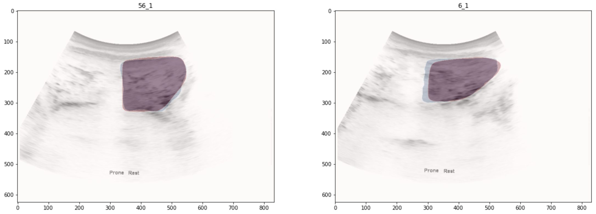

# PyTorch U-Net

## Description

U-Net을 PyTorch로 구현하여 LUMINOUS 데이터셋에 대해 훈련하였다.

U-Net은 본래 메디컬 이미지의 이미지 세그멘테이션 태스크를 위해 제안된 모델 구조이다. 이미지를 인코드하고 디코드하는 구조가 U자를 띄고 있기 때문에 이와 같은 이름이 붙여졌다. U-Net은 이해가 쉽고 다양한 업데이트를 거듭하며 좋은 성능을 보이고 있으며, 최근의 디퓨전 모델에서도 적용되어있다는 점에서 그 인기를 실감할 수 있다. 그리고 LUMINOUS는 요추 근육 초음파 이미지들로 구성된 퍼블릭 데이터셋으로 여기에서는 직접 구현한 U-Net으로 해당 데이터셋을 학습하고 테스트하였다. 테스트 이미지에 대해 정확도 0.98, IoU 0.91을 달성하였다.



# Usage
1. Git clone & Setup
```shell
$ git clone https://github.com/hijihyo/pytorch-unet.git
$ ./scripts/setup.sh
$ ./scripts/download_luminous.sh
```
2. Train & Test
```shell
$ python train.py
```
